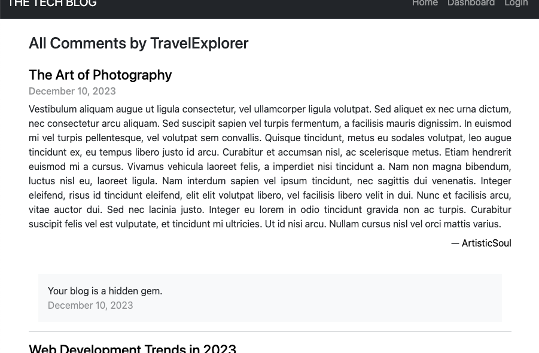
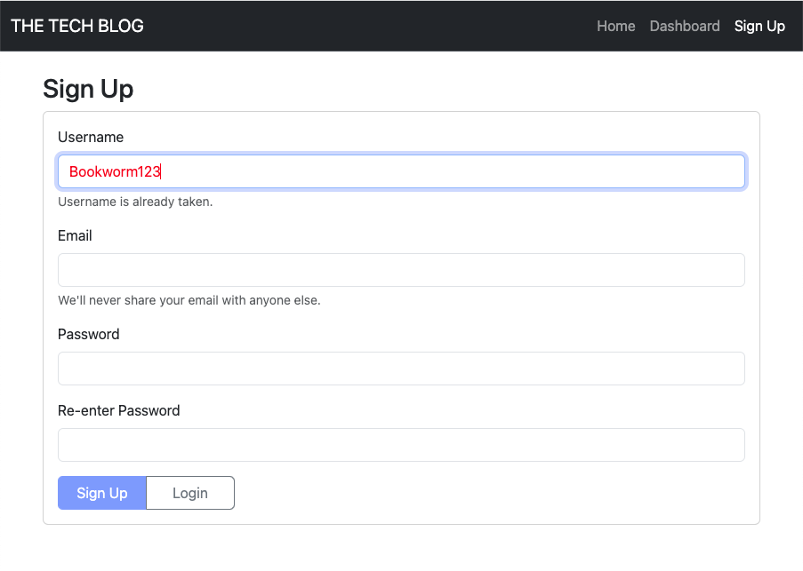
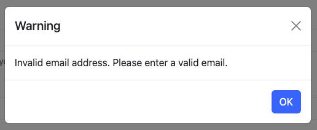

# Tech Blog

## Description 

For this project I built a simple content management system (CMS) style blog site similar to [Medium](https://medium.com/) where developers can publish blog posts and comment on other developers' posts as well. I followed the Model-View-Controller (MVC) paradigm, although because of some of the complexity of user interactions, the View and Controller portions were somewhat intertwined. I used Handlebars.js as the templating language, Sequelize for Object-Relational Mapping (ORM), and Express-Session for authentication.

This project has been deployed to [Heroku](https://www.heroku.com/) and can be accessed [here](https://technology-blog-mvc-bc5dd727c749.herokuapp.com/).


## Installation

To install the application locally, copy the files and folders to the desired location. To install dependencies, enter the command

```
npm install
```

from the root directory.

To seed the database with example data, enter the command

```
npm run seed
```

again from the root directory.


## Usage 

The application can be run from its deployed location [here](https://technology-blog-mvc-bc5dd727c749.herokuapp.com/).

To run it locally, enter the command
```
npm run start
```
from the root directory. Then open the following address in your web browser:
```
http://localhost:3001
```

When opened, the **Home page** is displayed, showing a navigation bar with **Home**, **Dashboard**, and **Login** links. Below the header is a listing of published post titles with dates and author usernames.


Clicking on a post causes the content to "un-collapse" and reveal the post content and a **Comments** header.


"Clicking on the **Comments** header "un-collapses" the comments, if any. The Comments header, the post titles, and any username (post and comment authors) are links throughout the site. This is indicated by a light blue background highlight on hover.


If the post title is clicked, a single-post view will be displayed. Clicking on any post title on any page throughout the site will always bring the user to this single-post view.


If a username is clicked on any page throughout the site, whether a post or a comment author, an **All Posts by...** view will be displayed. These posts and their comments can be clicked on and expanded just like on the **Home page**.


If the **See all comments by...** link is clicked, an **All Comments by...** view will be displayed, showing all that user's comments and comment dates with their associated posts titles and post dates.


Clicking on the post-comment pair will cause the post to "un-collapse" and reveal the post's content and author. A **See all posts by...** link at the bottom of the page returns the user to the **All Posts by...** page.



Clicking on the **Dashboard** or **Login** navigation links will take the user to the **Login page**. The user can choose to login or alternatively click the **Sign Up** button.


On the **Sign Up page**, the user can create an account with a username, email and password. The username is checked against existing usernames as each character is entered; if the user types a username that is already in use, the input is changed to red text and a warning messaged is displayed. The **Submit** is disabled if the username is not at least three characters long.



When the email input field loses focus, the entered email address is validated against a standard format using a regular expression. If the entered email address does not match a valid format, the input field is cleared and the user is warned with a modal.

On clicking the **Submit** button, additional checks are performed. If any field is empty, the user is warned with a modal. If the two passwords don't match, the password input fields are cleared and the user is warned with a modal.




On successful login or sign up, the authenticated user will be returned to the **Home page**. Now if the user expands a post and comments, a **New Comment** button will appear, and the user can create new comments on any post.


On clicking the **New Comment** button, the authenticated user is brought to the single-post page again. This time there is a comment input field available for text entry, with **Save** and **Cancel** buttons. If the user clicks **Save**, the new comment is added to the database and displayed under the post. If the user clicks **Cancel**, the new comment is discarded.


After clicking save, the new comment is immediately placed at the top of the list.


On clicking the **Dashboard** navigation link, the authenticated user is brought to the **Dashboard My Posts page**. The user's posts, if any, will be listed by title and publication date. A **New Post** button is displayed at the top right, and a **See all my comments** link is displayed at the bottom.


If the user clicks on a post, it "un-collapses" and three additional buttons are displayed: **Edit**, **Delete**, and **Unpublish**. If the revealed **Comments** header is clicked, the comments are expanded and a **New Comment** button is also displayed. (The user can comment on their own post if they want to.)


If the user clicks the **Edit** button, the post title and content are changed to text entry fields and can be modified. **Save** and **Cancel** buttons are also displayed.

If the user clicks the **Cancel** button, any changes are discarded and the unchanged post is restored. If the user clicks the **Save** button, any changes are updated to the database.


If the user clicks the **Delete** button, a warning and request for confirmation is displayed. Clicking **OK** will delete the post from the database. Clicking **Cancel** will cancel the delete request.


If the user clicks the **Unpublish** button, the publication data is changed to ```DRAFT``` and the post will not be displayed to other users on any page. The button becomes a **Publish** button, and if clicked will restore published status with the current date.


If the user clicks the **New Post** button, title and post body text entry fields for a new post will be displayed along with **Save** and **Cancel** buttons. 

If the user clicks the **Cancel** button, the new post with any input is discarded. If the user clicks the **Save** button, the post is saved to the database with DRAFT status. The **Save** and **Cancel** buttons are replaced with **Edit**, **Delete**, and **Publish** buttons. Once the user clicks the **Publish** button, the new post is given a publication data and will be visible to other users.


If the user clicks the **See all my comments** link, the **Dashboard My Comments page** is displayed. The user's comments, if any, will be listed together with their associated post title. A **See all my posts** link at the bottom of the page returns the user to the **Dashboard My Posts page**.


If the user clicks the post-comment pair, the post content is uncollapsed. **Edit** and **Delete** buttons are also displayed.


If the user clicks the **Edit** button, the comment is changed to a text entry field and can be modified. **Save** and **Cancel** buttons are also displayed.

If the user clicks the **Cancel** button, any changes are discarded and the unchanged comment is restored. If the user clicks the **Save** button, any changes are updated to the database.


If the user clicks the **Delete** button, a warning and request for confirmation is displayed. Clicking **OK** will delete the comment from the database. Clicking **Cancel** will cancel the delete request.


If the user clicks the **Logout** navigation link, their session will be ended and they will be returned to the login page. Additionally, if the session cookie expires, they will also be logged out. Any page requests or attempts to perform actions requiring authentication, such as creating a post or adding a comment, will be redirected to the login page.

For demonstration purposes, the current cookie expiration is set at five minutes.


## Credits

I used the following software packages in this project:
- [Express](https://www.npmjs.com/package/express) to manage routing
- [express-session](https://www.npmjs.com/package/express-session) for session management
- [bcrypt](https://www.npmjs.com/package/bcrypt) for password hashing
- [MySQL2](https://www.npmjs.com/package/mysql2) to create a relational database for application data
- [Sequelize](https://www.npmjs.com/package/sequelize) to interact with and manage a MySQL database
- [connect-session-sequelize](https://www.npmjs.com/package/connect-session-sequelize) for session management using Sequelize as the session store
- [Dotenv](https://www.npmjs.com/package/dotenv) to load environment variables from a ```.env``` file into ```process.env```
- [Handlebars](https://handlebarsjs.com/) with [Express Handlebars](https://www.npmjs.com/package/express-handlebars) as a templating engine to generate dynamic HTML
- [Bootstrap](https://www.npmjs.com/package/bootstrap) for styling and page components including modals
- [Nodemon](https://www.npmjs.com/package/nodemon) for automatic application restart on file change during development


## License

Please refer to the LICENSE in the repo.


---
